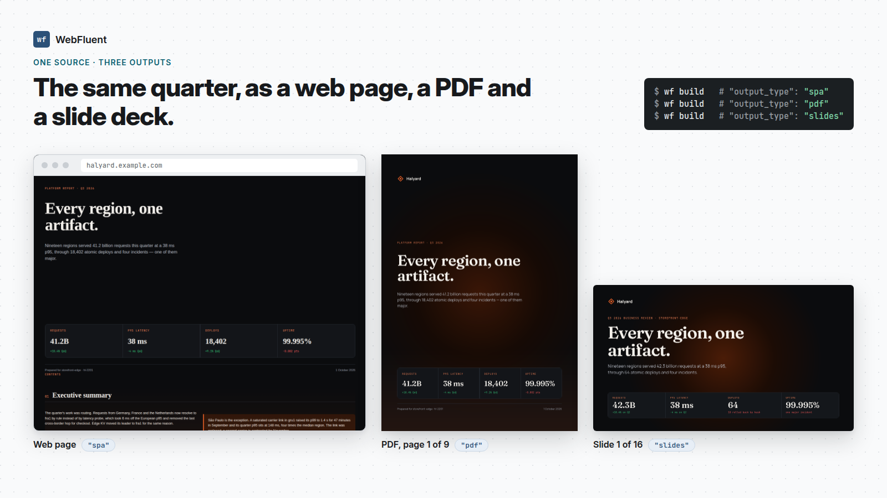

# WebFluent

**One binary. Websites, PDFs and slide decks from one language.** No Node, no framework, no build config — and no browser for your PDFs.

**[See it](https://webfluent.monzeromer.dev/showcase)** · **[Docs](https://webfluent.monzeromer.dev)** · **[Tutorial](https://webfluent.monzeromer.dev/docs/guide/tutorial)** · **[Components](https://webfluent.monzeromer.dev/docs/reference)** · **[Guide source](md-docs/)**

<!-- hero: one file, three outputs -->
<p align="center"></p>

WebFluent compiles `.wf` files to a website (HTML, CSS and a small JavaScript runtime), to PDF documents with real page layout, and to slide decks. The same file can be all three. The PDFs come from WebFluent's own layout engine — flexbox and grid, shaped text, Arabic and right-to-left, embedded font subsets — built into `wf`, a 10 MB download.

```wf
store Todos {
    state items = []

    action add(title: String) {
        items = items.concat([{ id: uuid(), title: title, done: false }])
    }
}

page Home(path: "/", title: "Todos") {
    use Todos
    state draft = ""

    Container {
        Heading("Todos").h1
        Row(gap: .sm) {
            Input(bind: draft, placeholder: "What needs doing?").text
            Button("Add").primary { on click { Todos.add(draft)  draft = "" } }
        }
        for t in Todos.items by t.id {
            Card { Text(t.title) }
        }
    }
}

app { Router }
```

That is the whole app — routing, reactivity, styling and the components included.

## Try it

**macOS and Linux** — the binary for your platform, no Rust needed:

```bash
curl -sSL https://raw.githubusercontent.com/monzeromer-lab/WebFluent/master/install.sh | bash
```

<sub>**Windows:** `irm https://raw.githubusercontent.com/monzeromer-lab/WebFluent/master/install.ps1 | iex` · **With Rust** (everywhere Rust runs, and the way to install on Linux arm64): `cargo install webfluent` · A `.deb`, `.msi` and tarballs are attached to each [release](https://github.com/monzeromer-lab/WebFluent/releases).</sub>

```bash
wf --version
wf init my-app        # -t spa (default) · static · pdf · slides
cd my-app
wf serve              # http://localhost:3000, rebuilds on save
```

`wf build` writes the finished site to `build/` — static files any host serves. [Deploying](md-docs/29-deploying.md) has GitHub Pages, Netlify, Vercel, Cloudflare and nginx.

<sub>If the shell cannot find `wf`, open a new terminal — the installer adds its directory to your `PATH` in your shell's startup file. `WF_INSTALL_DIR` installs elsewhere, `WF_VERSION` pins a release.</sub>

## What you get

- **Reactivity without a framework** — signals update the exact DOM node that changed. No virtual DOM, no diffing.
- **50+ components, already designed** — layout, navigation, tables, forms, modals, media. Styled by design tokens you can retheme in ten lines.
- **A compiler that actually checks your work** — types, props, flags, slots and events, plus lints for accessibility, SEO and dead code. A typo is an error with a line number, never a silent no-op.
- **Ships small** — the build keeps only the runtime modules your program reaches, splits a chunk per page, and precompresses everything. A page of static text ships under 4 kB of script, gzipped.
- **Four targets, one language** — SPA, pre-rendered static site, PDF, or a slide deck, by one config flag.
- **PDFs without a browser** — a paged layout engine in the binary: the same CSS cascade, flexbox and grid as the page, text shaped with kerning and ligatures, Arabic and right-to-left, tables that break between rows with their header repeated, a table of contents with page numbers, fonts embedded as searchable subsets. [Invoices, reports and résumés]({H}/showcase) in the gallery are real output.
- **Batteries included** — routing, stores, forms and validation, `fetch` as a typed `api`, i18n with automatic RTL, animations, dark mode.
- **A template engine for Rust and Node** — render a `.wf` template with your own data to HTML, a fragment or a PDF: `Template::from_dir("templates")?.page("Invoice")?.render_pdf(&invoice)` with any `Serialize` struct, or `npm install webfluent`. Untrusted data is escaped, and a URL that would run script is dropped.
- **Your own JavaScript, by name** — a plain `.js` file under `src/` is linked as written, and `.wf` code calls its functions directly, checked against their JSDoc. Libraries load from a CDN through `meta.scripts`; any element can be handed to a script with `mount:` and `cleanup:`.
- **Editor support** — a language server for [Zed](editors/zed) and [VS Code](editors/vscode): completion, hover, signature help, go to definition, references, rename, formatting, inlay types, semantic highlighting, quick fixes.

## A taste

<details>
<summary><b>Components, props and flags</b></summary>

```wf
/// A person, at a glance.
component UserCard(_ name: String, role: String, active: Bool = true) {
    Card.elevated {
        Row(align: .center, gap: .md) {
            Avatar(initials: "U").primary
            Stack {
                Text(name).bold
                Text(role).muted
            }
            if active { Badge("Active").success }
        }
    }
}

UserCard("Monzer", role: "Developer")
```

A `.flag` sets a boolean prop or picks an enum case. A flag the component does not declare is a compile error, with the ones it does take listed.
</details>

<details>
<summary><b>Data fetching</b></summary>

```wf
resource users = fetch("/api/users")

match users {
    loading      { Spinner }
    error(err)   { Alert("Failed to load").danger }
    ready(users) { for u in users by u.id { UserCard(u.name, role: u.role) } }
}
```

Describe a whole service once with `api`, and every call site is typed, cached, retried and cancellable.
</details>

<details>
<summary><b>Styling</b></summary>

```wf
Button("Save").primary.lg.rounded

Button("Custom") {
    style {
        background: $surface
        padding: $xl
        &:hover { background: $primary }
        @md { padding: $lg }
    }
}
```

`$token` is a design token, `{expr}` reads state. Any `.css` file under `src/` is bundled too.
</details>

<details>
<summary><b>Braces or indentation</b></summary>

A `.wf` file writes blocks in braces; a `.wfx` file writes them by indentation. Same grammar, same output — `wf fmt --to wfx` switches a project either way.

```wfx
page Home(path: "/", title: "Home")
    state count = 0
    Container
        Heading("Welcome").h1
        Button("+1").primary
            on click
                count = count + 1
```
</details>

<details>
<summary><b>PDFs and slides</b></summary>

```wf
page Deck(path: "/", title: "Q1 Review") {
    Presentation {
        TitleSlide("Q1 Review", subtitle: "March 2026")
        Slide {
            Heading("Highlights").h1
            List { Text("Revenue grew 15%")  Text("Expanded to 5 markets") }
        }
        SectionSlide("Q2 Plan").primary
    }
}
```

Set `"output_type": "slides"` (or `"pdf"`) and `wf build` writes the PDF, laid out by WebFluent's own paged engine — no browser, no external tool. Interactive components are rejected at compile time rather than silently dropped.
</details>

## CLI

```
wf init <name> [-t spa|static|pdf|slides]   Create a project
wf build [-d DIR] [--stats]                 Compile; --stats prints what it weighs
wf check [--format json|sarif|github]       Every finding, nothing written; --deny-warnings for CI
wf explain [CODE]                           What a diagnostic means, and the fix
wf serve [-d DIR]                           Dev server with live reload
wf generate page|component|store <name>     Scaffold a file
wf fmt [path] [--check] [--to wfx|wf]       Format, or switch layout
wf test [path] [--update]                   Run the project's tests, in a browser when one acts
wf verify [path] [--json] [--budget MS]     Visit every route in a headless browser (--returning-visitor: again, with storage)
wf docs [-d DIR] [-o OUT]                   Write a component gallery
wf render <tpl|dir> [--data f.json] [-f pdf] [--page P]   Use WebFluent as a template engine
wf audit [path] [--json]                    What the project trusts
wf registry|types [--json]                  The registry, and what a project declares
wf migrate [path] [--check] [--wfx]         Bring an older project up to date (WebFluent 2 onward)
```

## Documentation

- **[See it](https://webfluent.monzeromer.dev/showcase)** — real PDFs and decks rendered from the examples, opened straight in your browser
- **[The documentation](https://webfluent.monzeromer.dev)** — built with WebFluent itself: getting started, a tutorial that ends in a deployed site, the language, and deploying
- **[Reference](https://webfluent.monzeromer.dev/docs/reference)** — every component, [CLI command](md-docs/37-cli.md), [config key](md-docs/38-configuration.md), [diagnostic](md-docs/39-diagnostics.md) and [keyword](md-docs/43-grammar.md)
- **[PDF benchmark](bench/pdf/RESULTS.md)** — WebFluent against headless Chrome on the same invoice: method, machine and results, reproducible with `just bench-pdf`
- **[Troubleshooting](md-docs/44-troubleshooting.md)** and **[upgrading](md-docs/45-upgrading.md)**
- **[The guide's source](md-docs/)** — the same chapters as Markdown; every code block in them is compiled by the test suite

## How it works

```
.wf source → Lexer → Parser → Type checker → Linters → Code generator → HTML + CSS + JS
                                                     → Static HTML + CSS → Paged engine → PDF
```

The compiler is Rust. The generated JavaScript is a small signal-based runtime with no dependencies, and the build keeps only the parts a program reaches.

A PDF or a deck is the page, printed: the program is rendered to the static HTML and CSS a template renders, and the paged engine lays that out on paper — the cascade, block, flex and grid layout, pagination, then text and paint. It stands on excellent crates: [taffy](https://github.com/DioxusLabs/taffy) for flexbox and grid, [rustybuzz](https://github.com/harfbuzz/rustybuzz) for text shaping, [ttf-parser](https://github.com/harfbuzz/ttf-parser) and [fontdb](https://github.com/RazrFalcon/fontdb) for fonts, [unicode-bidi](https://github.com/servo/unicode-bidi) and [unicode-linebreak](https://github.com/axelf4/unicode-linebreak) for text direction and line breaking, [usvg](https://github.com/linebender/resvg) for SVG, and [krilla](https://github.com/LaurenzV/krilla) — the PDF writer Typst's PDF export also uses — for the file itself.

## How it's built

WebFluent is AI-written and human-directed: the language, its design and every decision are mine; most of the code is written with AI under that direction. What keeps it honest is checked, not promised — every code block in the guide is parsed, type-checked and compiled by the test suite, CI builds every `wf init` template and the documentation site, and each release is gated on it.

## Stability

**5.x is the stable line.** From the first launch video until four weeks after it, releases are patch-only and batched at most weekly — no syntax changes and no breaking changes — so the code in the videos keeps compiling on the latest release.

To build the compiler from a clone — for an unreleased change, or to work on it:

```bash
git clone https://github.com/monzeromer-lab/WebFluent.git
cd WebFluent && cargo install --path .
```

Contributions welcome — see [the spec](spec/SPEC.md) for what the language promises.

## License

[MPL-2.0](LICENSE). Changes to WebFluent's own files stay open; using it in a closed product is fine.

The sites, PDFs and slide decks you build with WebFluent are yours, under any license you choose. The runtime WebFluent writes into a site is MPL-2.0, which lets it ship inside closed code.
